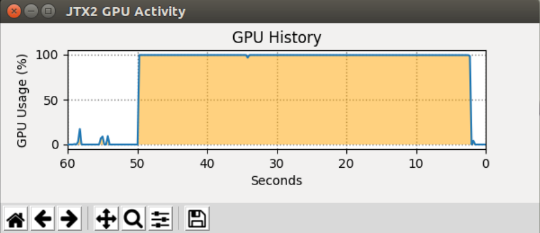

# Tools for use on the Jetson tegra TX2 Nvidia edge compute node (JTX2)

Specifically the AAEON form-factor.


## jtx2-show-gpu




```zsh

Usage: jtxt2-show-gpu [OPTIONS]

  Plot JTX2 GPU usage

Options:
  --version                 Show the version and exit.
  -i, --interval INTEGER    Update graph rate in ms  [default: 250]
  -f, --gpu-load-file TEXT  Load file  [default: /sys/devices/gpu.0/load]
  --help                    Show this message and exit.
```


# Resources

 - https://github.com/jetsonhacks/gpuGraphTX

